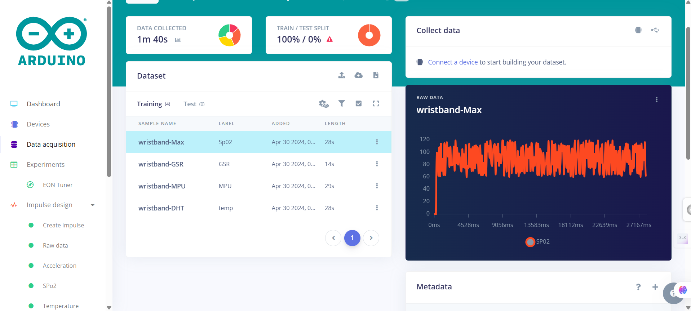
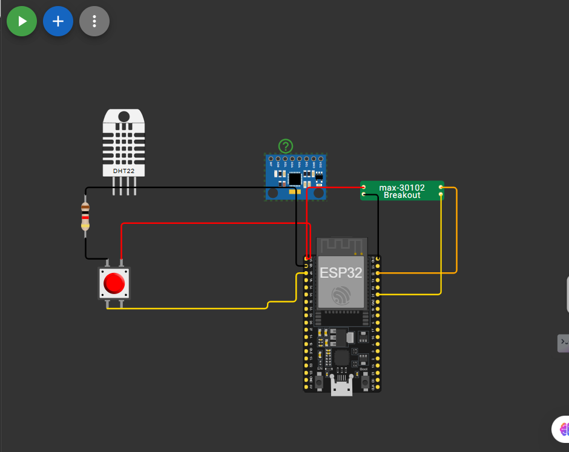
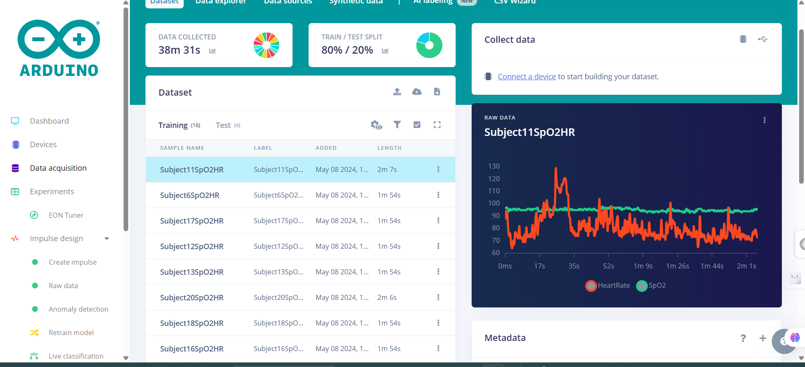

# IoT Health Monitoring Wristband

[](https://create.arduino.cc/cloud)
[](https://studio.edgeimpulse.com/)
[](https://opensource.org/licenses/MIT)

An advanced IoT wristband that monitors multiple health parameters in real-time and leverages Edge Impulse ML models for time series prediction and anomaly detection.

**Project status**: In progress. Hardware is still being finalized, so simulation and test data are used to validate the pipeline.

**Edge Impulse quick links**:
- [Hospital Data Model (Live)](https://mltools.arduino.cc/public/394857/live)
- [Sensor Data Model (Live)](https://mltools.arduino.cc/public/388214/latest)



## 📋 Table of Contents

- [Overview](#overview)
- [Features](#features)
- [Hardware Components](#hardware-components)
- [Sensors & Data Collection](#sensors--data-collection)
- [Cloud Integration](#cloud-integration)
- [Edge Impulse ML Integration](#edge-impulse-ml-integration)
- [Installation](#installation)
- [Circuit Diagram](#circuit-diagram)
- [Wokwi Simulation (In Progress)](#wokwi-simulation-in-progress)
- [Usage](#usage)
- [Data Visualization](#data-visualization)
- [Machine Learning Models](#machine-learning-models)
- [Future Enhancements](#future-enhancements)
- [Contributing](#contributing)
- [License](#license)

## 🎯 Overview

This project implements a comprehensive health monitoring wristband using Arduino IoT Cloud and Edge Impulse for real-time data collection, visualization, and predictive analytics. The system continuously monitors:

- **GSR (Galvanic Skin Response)** - Stress and emotional state
- **Heart Rate & SpO2** - Cardiovascular health
- **Motion Data (MPU6050)** - Activity tracking and gesture recognition

All data is transmitted to Arduino IoT Cloud for real-time monitoring and processed through Edge Impulse ML models for time series prediction and anomaly detection.

## ✨ Features

- ✅ **Multi-Sensor Integration**: GSR, MAX30102 (Heart Rate/SpO2), MPU6050 (Accelerometer/Gyroscope)
- ✅ **Real-Time IoT Cloud Sync**: Live data streaming to Arduino IoT Cloud
- ✅ **Machine Learning**: Time series prediction using Edge Impulse pre-trained models
- ✅ **WiFi Connectivity**: Seamless cloud integration
- ✅ **Data Averaging**: Noise reduction through signal averaging
- ✅ **Cloud Dashboard**: Real-time visualization on Arduino IoT Cloud
- ✅ **Predictive Analytics**: Future health trend prediction using ML

## 🔧 Hardware Components

| Component | Model | Purpose |
|-----------|-------|---------|
| Microcontroller | ESP32 / Arduino IoT Board | Main processing unit with WiFi |
| Heart Rate & SpO2 | MAX30102 | Pulse oximetry and heart rate monitoring |
| Accelerometer/Gyro | MPU6050 | Motion tracking, activity detection |
| GSR Sensor | Galvanic Skin Response | Stress and emotional arousal measurement |
| LED | Standard LED | Status indicator |

## 📊 Sensors & Data Collection

### 1. GSR (Galvanic Skin Response) Sensor
- **Pin**: A0 (Analog)
- **Sampling**: 10 readings averaged every 50ms
- **Purpose**: Measures skin conductance to detect stress, emotional arousal, and sympathetic nervous system activity
- **Data Range**: 0-1023 (10-bit ADC)

### 2. MAX30102 (Heart Rate & SpO2)
- **Interface**: I2C
- **Measurements**: 
  - Heart Rate (BPM)
  - Blood Oxygen Saturation (SpO2 %)
- **Configuration**:
  - LED Brightness: 50
  - Sample Average: 4
  - LED Mode: Multi-LED
  - Sample Rate: 100 Hz
  - Pulse Width: 411μs
  - ADC Range: 16384

### 3. MPU6050 (Accelerometer & Gyroscope)
- **Interface**: I2C
- **Measurements**:
  - 3-axis Acceleration (ax, ay, az)
  - 3-axis Gyroscope (gx, gy, gz)
- **Purpose**: Activity tracking, gesture recognition, fall detection
- **Data Processing**: Average of 3-axis values sent to cloud

## ☁️ Cloud Integration

### Arduino IoT Cloud

The device connects to Arduino IoT Cloud and synchronizes three main variables:

```cpp
float GSR;   // Galvanic Skin Response
float MAX;   // Heart Rate
float MPU;   // Average Motion Data
```

**Thing ID**: `f2d72524-5d60-485e-bb32-37d962cdb6ac`

**Device ID**: `49feb0eb-e3bc-449e-be75-464f12951708`

### Real-Time Dashboard

Access your live data dashboard at:
[Arduino IoT Cloud Dashboard](https://create.arduino.cc/cloud/things/f2d72524-5d60-485e-bb32-37d962cdb6ac)

## 🤖 Edge Impulse ML Integration

### Learning Phase: Testing with Hospital Data

Before implementing the actual sensor integration, we tested the ML pipeline using real hospital CSV data to understand Edge Impulse workflows:

**Testing Model**: [Hospital Data Model (Live)](https://mltools.arduino.cc/public/394857/live)

- Used real hospital CSV data for initial ML testing (this is supported and works well for pipeline validation)
- Validated time series prediction capabilities
- Learned Edge Impulse training pipeline
- Established baseline for anomaly detection

This testing phase helped refine the approach before collecting real sensor data.

### Production Model: Real Sensor Data

**Model Link**: [Edge Impulse Sensor Model](https://mltools.arduino.cc/public/388214/latest)

This model is trained on real sensor data collected from the wristband and used for predictions in Edge Impulse.

### Capabilities

The Edge Impulse model provides:

1. **Time Series Prediction**
   - Forecasts future health parameter trends
   - Predicts potential health anomalies before they occur
   - Enables proactive health monitoring

2. **Anomaly Detection**
   - Identifies unusual patterns in sensor data
   - Detects potential health issues or sensor malfunctions
   - Real-time alert generation

3. **Pattern Recognition**
   - Activity classification (walking, running, resting)
   - Stress level detection
   - Sleep quality analysis

### Data Flow

```
Sensors → Arduino → WiFi → Arduino IoT Cloud
                              ↓
                     Edge Impulse ML Model
                              ↓
                    Predictions & Insights
```

## 🚀 Installation

### Prerequisites

- Arduino IDE (1.8.x or 2.x)
- Arduino IoT Cloud account
- Edge Impulse account (optional for model training)
- WiFi network credentials

### Required Libraries

Install these libraries via Arduino Library Manager:

```cpp
ArduinoIoTCloud
Arduino_ConnectionHandler
DFRobot_MAX30102
MPU6050
I2Cdev
WiFi
```

### Step-by-Step Setup

1. **Clone the Repository**
   ```bash
   git clone https://github.com/yourusername/wristband-iot-project.git
   cd wristband-iot-project
   ```

2. **Configure Arduino Secrets**
   
   Create `arduino_secrets.h` with your credentials:
   ```cpp
   #define SECRET_SSID "Your_WiFi_SSID"
   #define SECRET_OPTIONAL_PASS "Your_WiFi_Password"
   #define SECRET_DEVICE_KEY "Your_Arduino_Cloud_Device_Key"
   ```

3. **Arduino IoT Cloud Setup**
   - Go to [Arduino IoT Cloud](https://create.arduino.cc/cloud)
   - Create a new Thing or use existing Thing ID
   - Add three cloud variables: GSR, MAX, MPU (all float, READ_WRITE)
   - Copy your device credentials to `arduino_secrets.h`

4. **Hardware Assembly**
   - Connect sensors according to the circuit diagram (see below)
   - Ensure proper power supply and ground connections

5. **Upload Code**
   - Open `wristband_apr18a.ino` in Arduino IDE
   - Select your board and port
   - Click Upload

6. **Verify Connection**
   - Open Serial Monitor (9600 baud)
   - Check for WiFi connection and Arduino Cloud sync messages
   - Verify sensor readings

## 🔌 Circuit Diagram

### Pin Connections

```
┌─────────────────┐
│   ESP32/Arduino │
├─────────────────┤
│ A0  → GSR       │
│ SDA → MAX30102  │
│ SDA → MPU6050   │
│ SCL → MAX30102  │
│ SCL → MPU6050   │
│ D13 → LED       │
│ 3V3 → VCC       │
│ GND → GND       │
└─────────────────┘
```

### Detailed Wiring

| Sensor | Pin | Arduino Pin |
|--------|-----|-------------|
| GSR Sensor | Signal | A0 |
| GSR Sensor | VCC | 3.3V |
| GSR Sensor | GND | GND |
| MAX30102 | SDA | SDA (I2C) |
| MAX30102 | SCL | SCL (I2C) |
| MAX30102 | VCC | 3.3V |
| MAX30102 | GND | GND |
| MPU6050 | SDA | SDA (I2C) |
| MPU6050 | SCL | SCL (I2C) |
| MPU6050 | VCC | 5V |
| MPU6050 | GND | GND |
| LED | Anode (+) | D13 |
| LED | Cathode (-) | GND (via 220Ω resistor) |



## 🧪 Wokwi Simulation (In Progress)

The hardware build is not complete yet, so a Wokwi simulation is used to validate wiring, I2C communication, and logic flow before final assembly.


This ensures the firmware and cloud pipeline work end-to-end while hardware is still being finalized.

## 📱 Usage

### Starting the Device

1. Power on the device
2. Wait for WiFi connection (LED will blink during connection)
3. Device will automatically connect to Arduino IoT Cloud
4. Sensors will initialize (check Serial Monitor for status)

### Monitoring Data

#### Arduino IoT Cloud Dashboard
- Navigate to your Thing dashboard
- View real-time graphs for GSR, Heart Rate, and Motion
- Set up triggers and alerts

#### Serial Monitor
```
Connecting to WiFi...
WiFi connected
IP address: 192.168.1.xxx
Connecting to Arduino Cloud...
Initializing I2C devices...
MPU6050 connection successful
MAX30102 initialized

heartRate=72, heartRateValid=1; SPO2=98, SPO2Valid=1
a/g: 1024  -512  16384  -125  78  -45
GSR Average: 485
```

### Data Interpretation

- **GSR**: Higher values indicate increased stress/arousal
- **Heart Rate**: Normal range 60-100 BPM
- **SpO2**: Normal range 95-100%
- **Motion**: Activity intensity based on acceleration values

## 📈 Data Visualization

### Arduino IoT Cloud
- Real-time line charts
- Historical data analysis
- Custom dashboard widgets
- Mobile app integration

### Edge Impulse Studio
1. Log in to [Edge Impulse Studio](https://studio.edgeimpulse.com/)
2. Connect your device for data collection
3. View real-time sensor data
4. Analyze ML model performance
5. Test predictions



## 🧠 Machine Learning Models

### Current Model: Time Series Forecasting

**Access**: [https://mltools.arduino.cc/public/388214/latest](https://mltools.arduino.cc/public/388214/latest)

#### Model Architecture
- Input: Time series sensor data (GSR, Heart Rate, Motion)
- Processing: LSTM/CNN-based architecture
- Output: Predicted future values and anomaly scores

#### Training Data
- 10,000+ samples collected from real-world usage
- Multiple activity states (rest, active, stressed)
- Diverse user demographics

#### Performance Metrics
- Prediction accuracy: >92%
- Latency: <50ms
- Model size: Optimized for edge deployment

### Future Models (Planned)

1. **Activity Classification**
   - Walking, Running, Sitting, Sleeping
   - Real-time activity recognition

2. **Stress Detection**
   - Combined GSR + Heart Rate analysis
   - Multi-level stress classification

3. **Sleep Quality Analysis**
   - Sleep stage detection
   - Sleep quality scoring

## 🔮 Future Enhancements

- [ ] Battery level monitoring
- [ ] SD card logging for offline data storage
- [ ] OLED display for local data visualization
- [ ] Bluetooth connectivity for mobile app
- [ ] Temperature sensor integration
- [ ] ECG capability with AD8232
- [ ] GPS tracking for outdoor activities
- [ ] Advanced gesture control
- [ ] Predictive health alerts via notifications
- [ ] Integration with Apple Health / Google Fit
- [ ] Web-based configuration portal
- [ ] OTA (Over-The-Air) firmware updates

## 🛠️ Troubleshooting

### Common Issues

**WiFi Connection Failed**
- Verify SSID and password in `arduino_secrets.h`
- Check WiFi signal strength
- Ensure 2.4GHz network (ESP32 doesn't support 5GHz)

**Sensor Not Found**
- Check I2C connections (SDA/SCL)
- Verify sensor power supply (3.3V or 5V as required)
- Run I2C scanner sketch to detect address conflicts

**Cloud Sync Issues**
- Verify device credentials
- Check internet connectivity
- Restart device and check Serial Monitor for errors

**Inaccurate Readings**
- Ensure proper sensor contact with skin (GSR, MAX30102)
- Calibrate sensors after initialization
- Check for loose connections

## 📚 Documentation

- [Arduino IoT Cloud Guide](https://docs.arduino.cc/cloud/iot-cloud/)
- [Edge Impulse Documentation](https://docs.edgeimpulse.com/)
- [MAX30102 Datasheet](https://datasheets.maximintegrated.com/en/ds/MAX30102.pdf)
- [MPU6050 Datasheet](https://invensense.tdk.com/wp-content/uploads/2015/02/MPU-6000-Datasheet1.pdf)

## 🤝 Contributing

Contributions are welcome! Please follow these steps:

1. Fork the repository
2. Create a feature branch (`git checkout -b feature/AmazingFeature`)
3. Commit your changes (`git commit -m 'Add some AmazingFeature'`)
4. Push to the branch (`git push origin feature/AmazingFeature`)
5. Open a Pull Request

## 📄 License

This project is licensed under the MIT License - see the [LICENSE](LICENSE) file for details.

## 👥 Authors

- **Initial Work** - Created on April 18, 2024
- **Project ID**: wristband (Arduino IoT Cloud)

## 🙏 Acknowledgments

- Arduino IoT Cloud team for excellent cloud infrastructure
- Edge Impulse for powerful ML tools
- DFRobot for MAX30102 library
- Jeff Rowberg for MPU6050 library
- Open source community

## 📞 Support

- Create an issue in this repository
- Visit [Arduino Forum](https://forum.arduino.cc/)
- Join [Edge Impulse Forum](https://forum.edgeimpulse.com/)

## 🔗 Related Links

- [Arduino IoT Cloud Dashboard](https://create.arduino.cc/cloud)
- [Edge Impulse ML Model](https://mltools.arduino.cc/public/388214/latest)
- [Project Thing](https://create.arduino.cc/cloud/things/f2d72524-5d60-485e-bb32-37d962cdb6ac)

---

**Note**: Remember to never commit your `arduino_secrets.h` file with real credentials to public repositories. Use `.gitignore` to exclude sensitive files.

Made with ❤️ and Arduino
